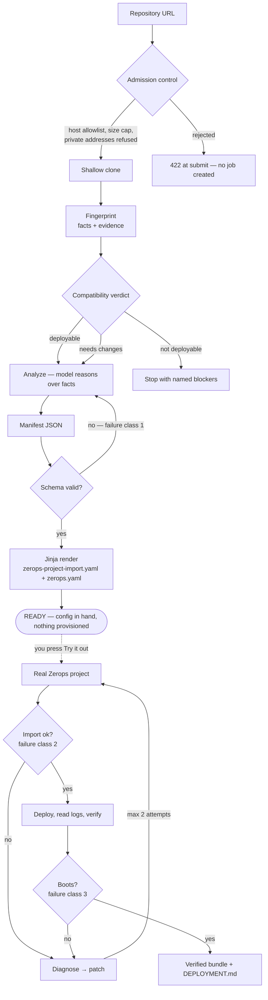
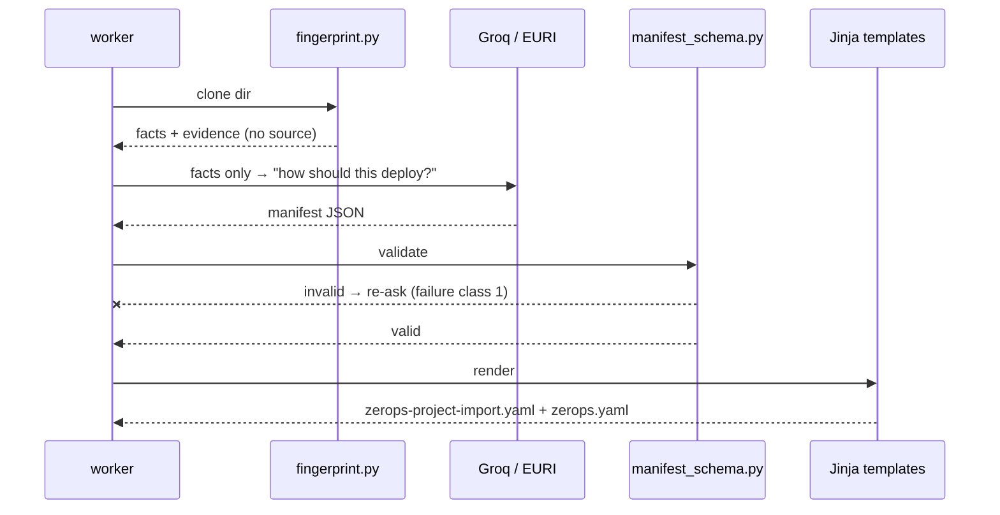
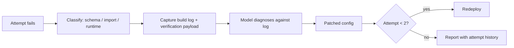
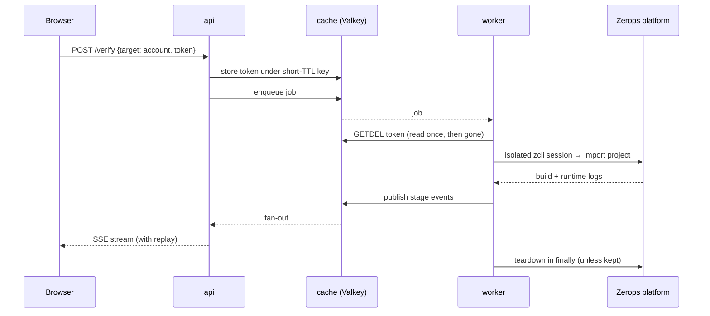
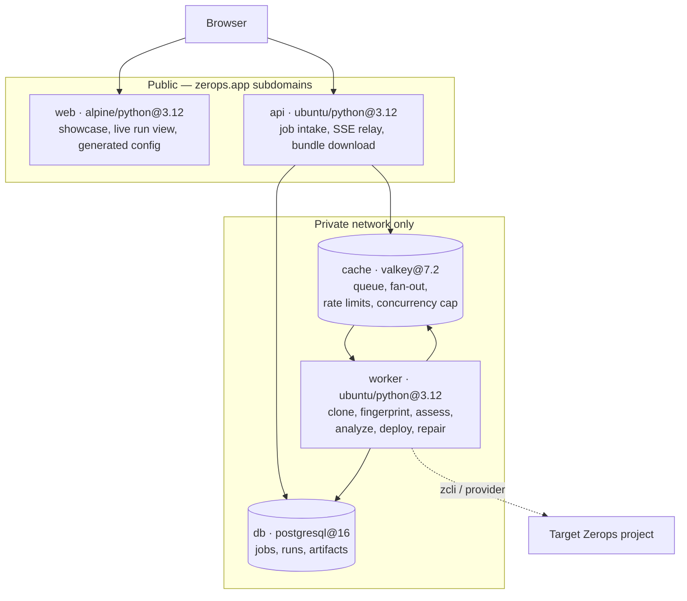
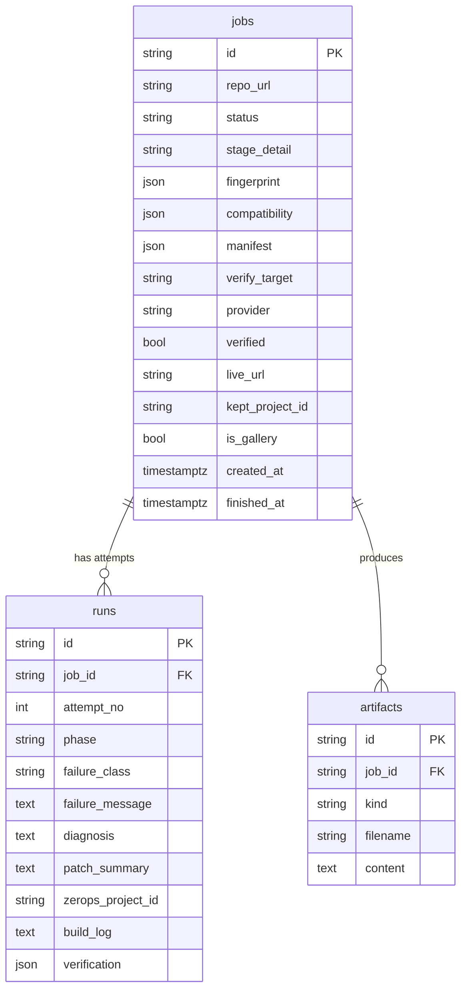

# 🧭 Zeroth — From Repository to Verified Deployment

**Zeroth** takes a public repository URL and answers the question every config
generator skips: *does this actually deploy?* It fingerprints the repo, judges
whether Zerops can run it at all, writes the platform configuration — and, if you
ask, provisions a real project, deploys, reads the logs, and repairs the config
when the build fails.

Most generators hand you plausible YAML. Plausible YAML that does not boot is
worse than none, so Zeroth proves it.

**Live demo:** [web-2b21-8080.prg1.zerops.app](https://web-2b21-8080.prg1.zerops.app) · **API:** [api-2b21-8000.prg1.zerops.app](https://api-2b21-8000.prg1.zerops.app)

---

## Table of Contents

- [Why Zeroth](#why-zeroth)
- [Feature Matrix](#feature-matrix)
- [The Pipeline](#the-pipeline)
- [Model-Driven Stages](#model-driven-stages)
- [⚙️ Deterministic Stages](#️-deterministic-stages)
- [System Architecture](#system-architecture)
- [Database Schema](#database-schema)
- [HTTP API](#http-api)
- [Tech Stack](#tech-stack)
- [Getting Started](#getting-started)
- [Environment Variables](#environment-variables)
- [Local Development](#local-development)
- [Project Structure](#project-structure)
- [Safety](#safety)
- [Roadmap](#roadmap)

---

## Why Zeroth

Deployment configuration is usually generated blind: a model reads a repository,
emits YAML, and nobody finds out whether it works until a human pastes it into a
real platform. Zeroth closes that loop. It treats a generated config as a
**hypothesis** and a real deployment as the **test** — schema validation, project
import, and runtime boot are three separate failure classes, each caught at the
cheapest level it can be caught at, with a repair loop behind them.

Two phases. The first is free, provisions nothing, and finishes in seconds. The
second only happens when you ask for it.

---

## Feature Matrix

| # | Feature | Type | Complexity driver |
|---|---------|------|--------------------|
| 1 | Deployability Verdict | ⚙️ Deterministic | Fingerprint evidence judged against emittable runtimes — no model call |
| 2 | Config Generation | Model | Facts-only reasoning → JSON manifest → schema validation → Jinja render |
| 3 | Real Verification Runs | ⚙️ Deterministic | Live project import, deploy, log read, teardown in `finally` |
| 4 | Diagnose → Patch → Redeploy | Model | Failure classification, log-grounded diagnosis, bounded retry (max 2) |
| 5 | Live Run Streaming | ⚙️ Deterministic | SSE relay over Valkey fan-out, with replay for late connections |
| 6 | Isolated Credential Handling | ⚙️ Deterministic | Short-TTL delete-on-read keys, per-run `zcli` session isolation |

---

## The Pipeline



### Why verification is opt-in

Deploying costs minutes and credits, and most people want to read the
configuration before anything is provisioned on their behalf. Stopping at
`READY` makes the common path fast and free, and turns the expensive part into a
deliberate act.

### Why failures are classified

A schema error costs milliseconds and no provisioning. An import rejection costs
one API call. A runtime failure costs a full build. Catching each at the cheapest
possible level is the difference between a demo and a tool.

---

## Model-Driven Stages

### Analyze — configuration from facts, never from source

`zeroth/worker/fingerprint.py` extracts facts from manifests, lockfiles,
`docker-compose.yml`, `Dockerfile` and `.env.example` — each carrying the
evidence that produced it. **Only those facts reach the model.** No repository
source code leaves the worker, and every generated service can answer *why is
this here?* with a filename.

The model emits JSON, which is validated against a local schema
(`zeroth/worker/manifest_schema.py`) before a single Jinja template renders.



### Repair — diagnosis grounded in real logs

When a verification attempt fails, the failure is classified, the build log is
captured into the `runs` row, and the model is asked to diagnose and patch
against *that log* rather than against a guess. Bounded to two attempts, because
an unbounded repair loop is a credit burner, not a feature.



---

## ⚙️ Deterministic Stages

### 1. Is this repository even deployable? (`zeroth/worker/compatibility.py`)

That is the first question anyone actually has, so it is the first one Zeroth
answers — before spending a model call on *how* to deploy it.

| Verdict | Deploy button | Meaning |
|---|---|---|
| **Deployable** | enabled | Runs on Zerops as it stands |
| **Needs changes** (advisory) | "Deploy anyway" | May still succeed — inferred values are shown for judgement |
| **Needs changes** (fatal) | **disabled** | The build cannot succeed as-is (bad encoding, no manifest anywhere); running would only prove it |
| **Not deployable** | **disabled** | No Zerops runtime, or a library rather than an application |

When anything actionable is found, Zeroth writes a **fix prompt** — the findings,
their evidence, and the platform constraints that matter — ready to paste into
your own coding agent. On request it goes one step further: **Draft the fix
with AI** produces a concrete unified diff for you to apply. That button is the
single exception to "no source code reaches the model" — it reads only the
files the findings cite, says so on the label, and hands the diff to you.
Zeroth never writes to your repository either way.

It checks runtime support and version availability, whether a dependency
manifest exists, whether anything declares how to start the application, port
binding, and containerisation. The finding that matters most in practice is a
**database in the dependencies with no connection string read from the
environment** — the exact shape of application that works on a laptop and fails
on every platform.

This stage is deliberately *not* a model call. These are the checks that can be
decided from evidence, so the stage costs nothing, cannot invent a blocker, and
is testable without an API key. Genuinely ambiguous questions are left to the
analyze stage rather than guessed at here.

### 2. Where a verification run lands (`zeroth/worker/pathfinder.py`)

| Target | What happens | Teardown |
|---|---|---|
| Throwaway project | Provisioned on Zeroth's own account | Always destroyed |
| Your Zerops account | Provisioned with a token you supply for that one run | Kept if it came up; failed attempts always destroyed |

The token is read once from a short-TTL key and deleted on read — never written
to the database, the logs, or the downloadable bundle — and each run gets an
isolated `zcli` session, because `zcli login` persists a session file rather
than authenticating per command. Without that isolation a run against your
account would overwrite Zeroth's own session, and concurrent runs would race for
the same credentials.



### 3. Live run streaming (`zeroth/bus.py`)

Stage transitions are published to Valkey and relayed to the browser over SSE,
with a replay buffer so a page that connects late still sees the run from the
top. A finished run is rebuilt from the stored record rather than the event
stream, so a shared link keeps working long after the buffer has expired.

---

## System Architecture



Only `web` and `api` are public; everything else talks over the private network.

`web` is a **runtime rather than `type: static`** — the static base 502'd with no
logs across several attempts, and serving the same files from `python -m
http.server` was a confirmed path rather than a guess. The reasoning is kept in
`zerops.yaml` next to the setup it explains.

Because `web` is served from its own origin, the browser cannot reach the API by
relative path. `web/config.js` carries the API base URL — checked in with a
localhost default for development, and overwritten at build time with the
deployed `api` subdomain.

---

## Database Schema



`runs` is the attempt log: one row per deploy attempt, carrying its failure
class, the diagnosis the model produced, and the patch it applied — which is what
makes the repair loop auditable after the fact.

---

## Verification with teeth

The fingerprint reads GET routes out of the sources (literal, parameter-free
paths only), and the post-deploy probe walks every one of them — application
checks, not just "the port answers". When a probe fails, the service's runtime
logs are fetched and fed to the repair loop, so a diagnosis reads a traceback
instead of guessing about a URL. Every repair records a **unified diff** of
what it changed, persisted per attempt and rendered in the run — the AI's
change as evidence, not prose.

## Pathfinder replay

Every state transition a run makes is persisted as a structured event, so a
finished run replays as a timeline — offsets, glyphs, failures and repairs in
order — long after the live stream is gone. The run page rebuilds the whole
story from the stored record: verdict, evidence, attempts, configuration, and
what got torn down.

## Bring your own key

A run can carry its own OpenAI-compatible LLM key (OpenAI, Groq, OpenRouter,
or any compatible endpoint — more presets coming). The key is used for that
run only: held under a short TTL, read by the worker, discarded when the run
settles, never written to the database, artifacts or logs. Runs on the house
keys get a per-run token budget; BYOK runs are exempt — your key runs until
your provider says otherwise.

## HTTP API

| Method | Path | Purpose |
|---|---|---|
| `POST` | `/api/jobs` | Submit a repository. Rejects unsupported hosts and oversized repositories here, before any job exists |
| `GET` | `/api/jobs/{id}` | Full record: fingerprint, verdict, manifest, artifacts, attempts |
| `POST` | `/api/jobs/{id}/verify` | Deploy a generated configuration. `{"target": "ephemeral"}` or `{"target": "account", "token": "..."}` |
| `GET` | `/api/jobs/{id}/events` | SSE stream, with replay for a browser that connects late |
| `GET` | `/api/jobs/{id}/bundle` | Downloadable bundle |
| `GET` | `/api/gallery` | Public completed runs |
| `GET` | `/healthz` | Liveness |

---

## Tech Stack

| Layer | Technology |
|---|---|
| API | FastAPI + Uvicorn (Python 3.12) |
| Worker | Standalone Python process, Valkey-driven queue |
| Frontend | Static HTML/JS + Tailwind, served by `python -m http.server` |
| Database | PostgreSQL 16 via SQLAlchemy 2 + `psycopg` |
| Queue & events | Valkey 7.2 (job queue, SSE fan-out, rate limits, concurrency cap) |
| Templating | Jinja2 (`import.yaml`, `zerops.yaml`, `DEPLOYMENT.md`) |
| Validation | Pydantic 2 + `jsonschema` |
| Models | Groq or EURI (analyze + repair stages) |
| Deploy provider | `zcli`, or a simulated provider for offline runs |
| Hosting | Zerops (5 services, private network, subdomains on `web`/`api`) |

---

## Getting Started

```bash
# provision the whole project — 5 services, wired
zcli project project-import import.yaml
```

Then set the credentials. **Set them as project-level environment variables**,
and note the gotcha: `import.yaml` declares `EURI_API_KEY`, `GROQ_API_KEY` and
`ZCLI_TOKEN` under `envSecrets` so the names are versioned without the values.
Those are *service-scoped* and service scope **shadows** project scope — an
empty service-level variable silently wins over a populated project-level one,
and the application reports no provider configured. Either fill the values in at
the service level, or delete the empty service-level entries so the project
values resolve.

## Tests

```bash
npm i -D @playwright/test
npx playwright install chromium        # or CHROME_PATH=/path/to/chrome
BASE_URL=https://<web-subdomain> npx playwright test
```

The E2E suite is read-only by design — it never presses deploy, so running it
costs nothing and cannot leave infrastructure behind.

## Environment Variables

| Variable | Needed for |
|---|---|
| `GROQ_API_KEY` or `EURI_API_KEY` | The analyze and repair stages. Without one, a run fails at `analyzing` |
| `ZCLI_TOKEN` | Deploying to the throwaway project. Not needed for the user's-own-account path |
| `PATHFINDER_PROVIDER` | `simulated` (default) or `zcli` |

## Local Development

```bash
pip install uv
uv pip install --system -r requirements.txt
cp .env.example .env          # PATHFINDER_PROVIDER=simulated needs no credentials

uvicorn zeroth.api.main:app --reload --port 8000   # terminal 1
python -m zeroth.worker.main                       # terminal 2
python -m http.server 5173 -d web                  # terminal 3

python -m zeroth.scripts.seed_gallery              # optional: sample runs
```

`web/config.js` already points at `http://localhost:8000`, so the UI on 5173
reaches the API without further configuration.

The simulated provider runs the whole pipeline without provisioning anything and
deliberately fails its first attempt, so the repair loop can be exercised
offline. Switch `PATHFINDER_PROVIDER=zcli` once credentials are in place.

The UI is three static pages: `index.html` is the showcase, `run.html` starts a
run or replays a finished one via `?job=<id>`, and `about.html` is the reference
page.

## Project Structure

```
zeroth/
├── zeroth/
│   ├── api/
│   │   ├── main.py                 # FastAPI app
│   │   └── routers/                # jobs, stream (SSE), bundle, gallery
│   ├── worker/
│   │   ├── main.py                 # process_analyze / process_verify
│   │   ├── ingest.py               # admission control + shallow clone
│   │   ├── fingerprint.py          # facts + evidence, no source code
│   │   ├── compatibility.py        # deployability verdict (no model call)
│   │   ├── analyze.py              # model → manifest JSON
│   │   ├── manifest_schema.py      # failure class 1 caught here
│   │   ├── generate.py             # Jinja render
│   │   ├── pathfinder.py           # real deploy: import, logs, teardown
│   │   ├── repair.py               # diagnose → patch → redeploy
│   │   ├── recipes.py              # known-good configurations
│   │   └── providers/              # zcli, simulated
│   ├── templates/                  # import.yaml.j2, zerops.yaml.j2, deployment.md.j2
│   ├── bus.py                      # Valkey pub/sub + replay buffer
│   ├── safety.py                   # host allowlist, size cap, rate limits
│   ├── models.py                   # jobs, runs, artifacts
│   └── scripts/seed_gallery.py
├── web/                            # index.html, run.html, about.html + config.js
├── docs/                           # ARCHITECTURE.md, DESIGN.md
├── import.yaml                     # 5-service project provisioning
└── zerops.yaml                     # api / worker / web setups
```

## Safety

- Public GitHub/GitLab only, size-capped, private addresses refused — all
  enforced at submit time, before a job is created.
- Repository code never executes on the Zeroth worker; it is only ever built
  inside the deployment target.
- Teardown runs in a `finally` block on every path. A project is kept only when
  it succeeded *and* you asked for it to land in your own account.
- Global concurrency cap and a per-IP hourly limit, keyed on the forwarded
  client address rather than the platform proxy — otherwise every visitor shares
  one bucket.
- No platform secrets are placed in ephemeral project environments.
- Verification tokens are delete-on-read and never persisted to the database,
  logs, or the downloadable bundle.

## Roadmap

- [ ] More runtimes in the emittable set — Go, Node, PHP beyond the current matrix
- [ ] Diff view between attempts: what the repair loop actually changed
- [ ] Recipe matching before the model call, for repositories with a known shape
- [ ] Re-verify a bundle on demand, to catch platform drift

---

## Built with

Zeroth was developed inside **ZCP**, Zerops' control-plane container, using
**Claude** as the coding agent driving the `zerops_*` MCP tooling — provisioning,
deploying, reading logs and verifying services against the live project rather
than against a local mock. The failure modes documented in `zerops.yaml` and
`zeroth/worker/providers/zcli.py` were all found that way: on a real account,
against a real deployment.
